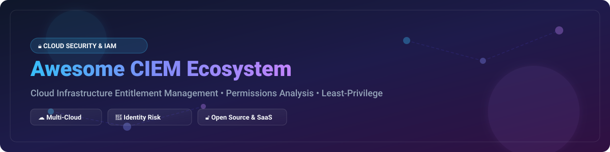
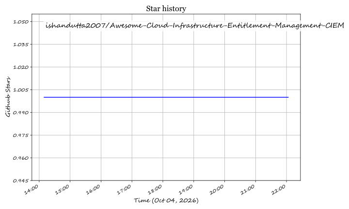

# Awesome Cloud Infrastructure Entitlement Management (CIEM) 🛡️

  
  
  
  
  

> **Curated List of Top SaaS Platforms & Open-Source Tools for Cloud Infrastructure Entitlement Management (CIEM)**  
> *Discover solutions for Cloud IAM Security, Permissions Analysis, Privilege Escalation Detection, and Automated Least-Privilege Enforcement across AWS, Azure, GCP, and Kubernetes.*

---

## 💡 Overview & SEO Highlights

**Cloud Infrastructure Entitlement Management (CIEM)** is a vital cloud security discipline focused on managing identity entitlements, detecting excessive permissions, and enforcing least-privilege policies across multi-cloud environments (AWS, Microsoft Azure, Google Cloud Platform).

This repository serves as a comprehensive directory for security architects, DevSecOps engineers, IAM specialists, and CISO teams evaluating commercial **SaaS platforms** and **open-source security tools**.

---

## 📖 Table of Contents

- [☁️ SaaS/Hosted Platforms](#-saashosted-platforms)
- [🔓 Open-Source GitHub Projects](#-open-source-github-projects)
- [🤝 How to Contribute](#-how-to-contribute)
- [💖 Support & Community](#-support--community)
- [⚠️ Disclaimer](#-disclaimer)
- [⭐ Star History](#-star-history)

---

## ☁️ SaaS/Hosted Platforms

> **📊 Market Context & Industry Size**: The global Cloud Infrastructure Entitlement Management (CIEM) market is estimated at **~$2.5B in 2026**, growing toward **~$7B by 2030** at a **~28% CAGR**. The sector is **moderately concentrated** with significant M&A activity (e.g. Google acquiring Wiz for $32B, CyberArk acquiring Zilla Security for $175M, Tenable acquiring Ermetic, and Delinea acquiring Authomize). Enterprises commonly combine dedicated CIEM or PAM products with broader CNAPP platforms.

Products below are sorted in **descending order of Company Size / Financial Scale** (Valuation / Acquisition Price / Annual Revenue):

| Platform | Description | Pricing (Starting Tier) | Free Tier / Free Trial Limits | Company Size & Market Scale (Sorted Descending) 📈 |
| :--- | :--- | :--- | :--- | :--- |
| **[Microsoft Entra Permissions Management](https://www.microsoft.com/en-us/security/business/identity-access/microsoft-entra-permissions-management)** | Microsoft's enterprise CIEM offering multi-cloud visibility and right-sizing across Azure, AWS, and GCP. | **$125 per resource per year** | **No permanent free tier** — 90-day free trial available via Azure. | **~$281B Revenue** (Microsoft FY2025) |
| **[Wiz](https://www.wiz.io/)** | Agentless CNAPP with deep CIEM, cloud security posture management, and threat detection capabilities. | **Enterprise pricing** (quote required; typically $100K+/yr) | **No free tier** — enterprise demo and custom proof-of-concept required. | **$32B Acquisition** (by Google), **$1B ARR** (2025) |
| **[Palo Alto Prisma Cloud CIEM](https://www.paloaltonetworks.com/prisma/cloud)** | Multi-cloud permissions discovery and graph-based analysis bundled inside Prisma Cloud CNAPP. | **Custom enterprise pricing** | **No free tier** — 30-day enterprise trial available upon request. | **~$9.2B Revenue** (Palo Alto Networks FY2025) |
| **[Orca Security](https://orca.security/)** | Agentless CNAPP platform with CIEM capabilities utilizing SideScanning technology. | **Custom enterprise pricing** (typically $50K–$200K/yr) | **No free tier** — 30-day free trial / demo available. | **$1B–$2.5B Valuation**, **$100M–$500M Revenue** |
| **[CyberArk Cloud Entitlements Manager](https://www.cyberark.com/)** | AI-driven cloud permissions manager for human and machine identity least-privilege enforcement. | **Custom pricing** | **No free tier** — enterprise interactive demo available. | **~$700M Revenue** (CyberArk FY2025 est.) |
| **[Ermetic (Tenable Cloud Security)](https://www.tenable.com/)** | Dedicated CIEM pioneer offering identity risk analysis, posture management, and automated remediation. | **Custom enterprise pricing** | **No free tier** — enterprise trial via Tenable Cloud Security. | **Part of Tenable** (~$900M Revenue) |
| **[Sonrai Security](https://sonraisecurity.com/)** | Cloud Permissions Firewall and CIEM platform with ChatOps least-privilege workflows. | **Custom enterprise pricing** (starts ~$50K/yr) | **No free tier** — enterprise demo available. | **$183.8M Valuation**, **$18.4M Revenue**, $38.5M Funding |
| **[Zilla Security](https://www.zillasecurity.com/)** | AI-powered identity governance and CIEM platform for access reviews and entitlement tracking. | **Custom enterprise pricing** | **No free tier** — acquired by CyberArk. | **$175M Acquisition** (by CyberArk), **$5M ARR** |
| **[Britive](https://www.britive.com/)** | Cloud-native privileged access management (PAM) with just-in-time (JIT) dynamic access provisioning. | **Custom enterprise pricing** (starts ~$25K/yr) | **No free tier** — enterprise demo required. | **$35.9M Funding**, **$2.8M Revenue** |
| **[Authomize](https://www.authomize.com/)** | Identity authorization management and CIEM platform focusing on cross-cloud identity security. | **Custom enterprise pricing** | **No free tier** — acquired by Delinea. | **Private / Acquired** (by Delinea) |

---

## 🔓 Open-Source GitHub Projects

Sorted by **Stars_Count (Descending)**. Click on any Stars_Badge to visit that repository's stargazers page! 🌟

| Repo / Tool | Description | GitHub_Stars 🌟 |
| :--- | :--- | :--- |
| **[Prowler](https://github.com/prowler-cloud/prowler)** | **The premier open-source multi-cloud security assessment tool.** Covers AWS, Azure, GCP, Kubernetes, M365, and Okta with 800+ checks and 65% AWS IAM privilege escalation coverage. Apache-2.0. |  |
| **[CloudQuery](https://github.com/cloudquery/cloudquery)** | **High-performance open-source data movement framework.** Extracts cloud configurations and IAM entitlements into SQL databases (PostgreSQL, Snowflake) for custom CIEM querying. Apache-2.0. |  |
| **[Cartography (Lyft)](https://github.com/lyft/cartography)** | **Infrastructure and IAM graph visualization platform.** Consolidates cloud assets and entitlements into a Neo4j graph database to map complex access paths ("who can reach what"). Apache-2.0. |  |
| **[Cloudsplaining (Salesforce)](https://github.com/salesforce/cloudsplaining)** | **AWS IAM policy analysis utility.** Scans IAM policies to highlight over-privileged roles, wildcards, and privilege escalation vectors in an HTML risk report. MIT. |  |
| **[PMapper (Principal Mapper)](https://github.com/nccgroup/PMapper)** | **AWS IAM privilege escalation pathfinder.** Uses graph theory and authorization simulation to determine actual access paths and privilege escalation routes. BSD-3-Clause. |  |
| **[policy_sentry (Salesforce)](https://github.com/salesforce/policy_sentry)** | **Preventative least-privilege IAM policy generator.** Generates restricted JSON IAM policies from clean YAML access declaration templates. MIT. |  |
| **[SkyArk (CyberArk)](https://github.com/cyberark/SkyArk)** | **AWS & Azure Shadow Admin discovery tool.** Scans cloud environments to detect hidden administrative privileges and sensitive IAM entities. MIT. |  |
| **[CloudTracker (Duo Labs)](https://github.com/duo-labs/cloudtracker)** | **AWS IAM least-privilege right-sizing tool.** Compares CloudTrail log activity against actual IAM policies to identify unused permissions. BSD-3-Clause. |  |
| **[IAMbic](https://github.com/noqdev/iambic)** | **GitOps-driven multi-cloud IAM management framework.** Provides bidirectional synchronization and temporary JIT access controls across AWS, Okta, and Google Workspace. Apache-2.0. |  |
| **[Mantissa Stance](https://explore.market.dev/ecosystems/aws/projects/mantissa-stance)** | Agentless cloud security engine with 37 collectors, 300+ YAML security policies, and attack path graph correlation for overprivilege detection. Proprietary / Free Tier. |  |

---

## 🤝 How to Contribute

Contributions are welcome! Help us keep this list up to date and comprehensive:

1. 🍴 **Fork** this repository.
2. 📝 Add or edit entries in `README.md` following the table formatting.
3. 🔗 Provide factual descriptions, official website links, and accurate Stars_Badges.
4. 🚀 Submit a **Pull Request** with a brief summary of changes.

---

## 💖 Support & Community

If you find this repository helpful, please consider supporting the project:

- ⭐ **Star this repository** on GitHub to help others discover it!
- 🔀 **Fork & Share** it with your cloud security colleagues and DevSecOps teams.
- ☕ **Sponsor the Maintainer**: Consider buying me a coffee or supporting open-source work via [GitHub Sponsors](https://github.com/sponsors/ishandutta2007).

---

## ⚠️ Disclaimer

- This list is **community-curated** for educational and reference purposes only.
- CIEM tools interact with critical IAM configurations and credentials; evaluate each tool carefully in non-production environments first.
- All financial figures and Stars_Counts reflect historical data and publicly available disclosures.

---

## ⭐ Star History

---

Made with ❤️ for Cloud Security Architects, IAM Engineers, and DevSecOps Teams worldwide.

## ⭐ Star History

<a href="https://star-history.com/#ishandutta2007/Awesome-Cloud-Infrastructure-Entitlement-Management-CIEM&Timeline" align="center">
  <picture>
    <source media="(prefers-color-scheme: dark)" srcset="assets/ishandutta2007_Awesome-Cloud-Infrastructure-Entitlement-Management-CIEM_growth.svg">
    
  </picture>
</a>
